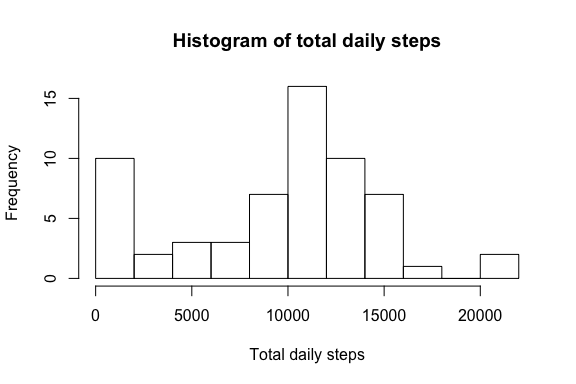

# Reproducible Research: Peer Assignment 1
Bob Wooster  
1/20/2017  


## Loading and preprocessing the data

First we load the data.  The preprocessing consists of convert the "date" column into the "Date" class and creating a dummy column, "int_num", to count the 5 minute intervals in the day.


```r
activity <- read.csv(file = "activity.csv")
activity$date <- as.Date(activity$date, "%Y-%m-%d")
activity$interval <- as.character(activity$interval)
activity$int_num <- rep(seq(1:288), times = 61)
summary(activity)
```

```
##      steps             date              interval            int_num      
##  Min.   :  0.00   Min.   :2012-10-01   Length:17568       Min.   :  1.00  
##  1st Qu.:  0.00   1st Qu.:2012-10-16   Class :character   1st Qu.: 72.75  
##  Median :  0.00   Median :2012-10-31   Mode  :character   Median :144.50  
##  Mean   : 37.38   Mean   :2012-10-31                      Mean   :144.50  
##  3rd Qu.: 12.00   3rd Qu.:2012-11-15                      3rd Qu.:216.25  
##  Max.   :806.00   Max.   :2012-11-30                      Max.   :288.00  
##  NA's   :2304
```

```r
str(activity)
```

```
## 'data.frame':	17568 obs. of  4 variables:
##  $ steps   : int  NA NA NA NA NA NA NA NA NA NA ...
##  $ date    : Date, format: "2012-10-01" "2012-10-01" ...
##  $ interval: chr  "0" "5" "10" "15" ...
##  $ int_num : int  1 2 3 4 5 6 7 8 9 10 ...
```

## What is mean total number of steps taken per day?

First we compute the total number of steps taken each day.  Missing values are
ignored.


```r
daily_total_steps <- tapply(activity$steps, activity$date, sum, na.rm = TRUE)
```

Next we create a histrogram of the total number of steps taken each day.  Here is where the 


```r
hist(daily_total_steps, main=NA, xlab=NA, breaks = 10)
title(main = "Histogram of total daily steps", xlab= "Total daily steps")
```



Finally we compute the mean and median numbers of steps each day.


```r
mean(daily_total_steps, na.rm = TRUE)
```

```
## [1] 9354.23
```

```r
median(daily_total_steps, na.rm = TRUE)
```

```
## [1] 10395
```

## What is the average daily activity pattern?

In this section we look at the number of steps taken versus time of day.  Here is where the "int_num" column is useful.  If we just use the "interval" column, 55 is followed by 100.  This will leave too wide a gap between the data points.


```r
time_series_mean <- tapply(activity$steps, activity$int_num, mean, na.rm = TRUE)
plot(names(time_series_mean), time_series_mean, type="l", main=NA, xlab=NA, ylab=NA, xaxt = "n")
axis(1, at = names(time_series_mean), labels = activity$interval[1:288])
title(main = "Average number of steps over 5 minute intervals", xlab="Time of day",
      ylab = "Average number of steps")
```


We identify the time interval with the highest average number of steps.

```r
activity$interval[which(time_series_mean == max(time_series_mean))]
```

```
## [1] "835"
```
Thus the time interval from 8:35-8:40 has the highest number of steps on average.


## Inputing missing values

In this section we turn our attention to the missing values.

First we compute the total number of NAs.

```r
sum(is.na(activity$steps))
```

```
## [1] 2304
```
Now we fill in the NA values.  It makes sense to use the data in like time intervals to fill in missing values.  However, since daily walking patterns might depend on which day of the week it is, we will use the mean for each five minute time interval for each day of the week.  We will create a new data frame which is equivalent to the original 'acitvity' data frame, but the NAs replaced with these means.


```r
activity_new <- activity
activity_new$weekday <- weekdays(activity$date)
lookup <- tapply(activity_new$steps, list(activity_new$interval, activity_new$weekday), mean, na.rm = TRUE)
rows <- which(is.na(activity_new$steps))
for(j in 1:length(rows)) {
      activity_new$steps[rows[j]] <- lookup[as.character(activity_new$interval[rows[j]]), activity_new$weekday[rows[j]]]
}
```

Let's make a new histogram of the total steps taken each day, and look at the daily mean and median, with the missing values filled in.


```r
new_daily_total_steps <- tapply(activity_new$steps, activity_new$date, sum)
hist(new_daily_total_steps, main=NA, xlab=NA, breaks = 10)
title(main = "Histogram of total daily steps (with missing values filled)", xlab= "Total daily steps")
```


```r
mean(new_daily_total_steps)
```

```
## [1] 10821.21
```

```r
median(new_daily_total_steps)
```

```
## [1] 11015
```
Notice that filling in the missing values resulted in the mean increasing from 9354.23 to 10821.21, and the median from 10395 to 11015.


## Are there differences in activity patterns between weekdays and weekends?

We conclude this report with an analyis of the steps taken on weekends versus weekdays.  We will work with the data with the NA values filled in, which was done in the previous section.  Our first task is to add a weekday/weekend column.


```r
activity_new$weekend <- "weekday"
activity_new$weekend[which(is.element(activity_new$weekday, c("Saturday", "Sunday")))] <- "weekend"
activity_new$weekend <- as.factor(activity_new$weekend)
```

Now we compute weekend/weekday averages.


```r
weekend_day_avg <- tapply(activity_new$steps, list(activity_new$int_num, activity_new$weekend), mean)
weekend_day_df <- data.frame(Steps = as.vector(weekend_day_avg), Day = c(rep("Weekday", 288), rep("Weekend", 288)), Interval = rep(1:288, times = 2))
```

We conclude the report with a panel plot of the average number of each steps taken in each five minute interval throughout the day split by weekend/weekday.  The "lattice" package is used to create the plot.


```r
library(lattice)
xyplot(weekend_day_df$Steps ~ weekend_day_df$Interval | weekend_day_df$Day, type = "l", xaxt = activity$interval[1:288], layout = c(1,2), main = "Weekend and weekday average number of steps over 5 minute intervals", xlab = "Time of day", ylab = "Average number of steps")
```


